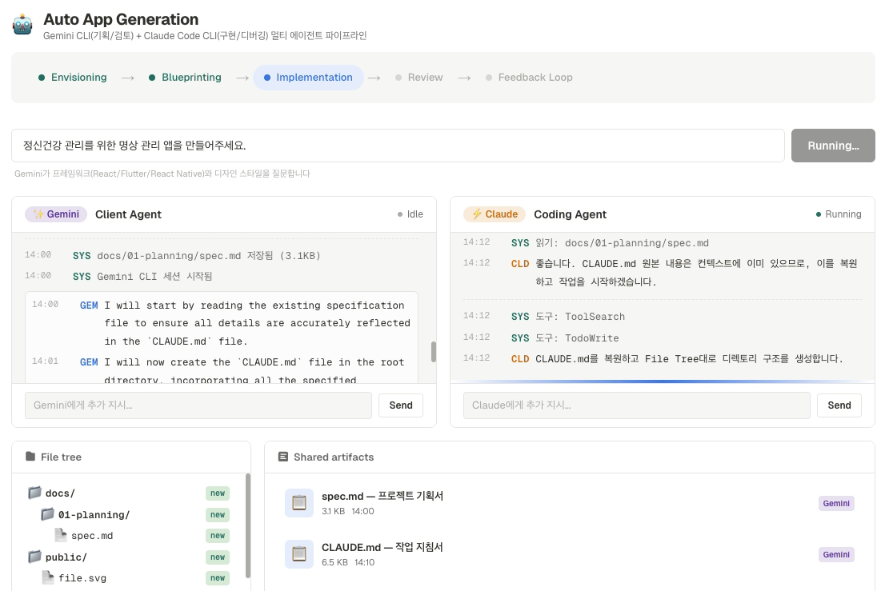

# MoE MoE Prototyping

<p align="center">
  
</p>

> **Gemini CLI + Claude Code CLI** 멀티 에이전트 MoE(Mixture of Experts) 파이프라인으로 **동작하는 프로토타입**을 자동 생성하는 오케스트레이션 대시보드 — **v2.5 Final Release**

아이디어 한 줄이면 **구상 -> 설계 -> MoE 게이팅 -> 병렬 구현 -> MoE 리뷰 -> 피드백**까지 6단계 파이프라인이 자동으로 실행됩니다. 3개의 Gemini 인스턴스가 프로젝트 복잡도를 분석하고, Claude Code 에이전트 + Stitch 2.0이 병렬로 코드를 구현하며, 3~5명의 Gemini 전문가가 동시에 리뷰합니다.

**프로토타이핑에 최적화:** 아이디어 검증, MVP 시연, 해커톤, 클라이언트 프레젠테이션 등 빠르게 동작하는 결과물이 필요한 모든 상황에서 활용할 수 있습니다.

**무료 사용:** Gemini Advanced + Claude Max 구독만 있으면 별도 API 비용 없이 로컬에서 실행됩니다.


### Dashboard Preview

<p align="center">
  
</p>

---

## Table of Contents

- [Architecture](#architecture)
- [Key Features](#key-features)
- [Pipeline — 6 Stages](#pipeline--6-stages)
- [Examples](#examples--generated-prototypes)
- [Quick Start](#quick-start)
- [Tech Stack](#tech-stack)
- [Project Structure](#project-structure)
- [Configuration](#configuration)
- [License](#license)
- [Credits](#credits)

---

## Architecture

```
                     "명상 관리 앱 만들어줘"
                              |
                              v
                 +----------------------------+
                 |     Dashboard (Next.js)     |
                 |   Realtime Monitor & Q&A    |
                 |   i18n (KO/EN) | Preview   |
                 +--------+--------+----------+
                          |
                          v
          +-------------------------------+
          |    FastAPI + Socket.IO Backend |
          |    Pipeline Orchestrator       |
          +------+----------------+-------+
                 |                |
      +----------+                +----------+
      v                                      v
+------------------+              +--------------------+
|   Gemini CLI     |              |  Claude Code CLI   |
|  gemini -p       |              |  claude -p         |
|                  |              |  --output-format    |
|  - Envisioning   |              |    stream-json     |
|  - Blueprinting  |              |                    |
|  - MoE Gating x3 |              |  - FE Agent        |
|  - MoE Review x5 |              |  - BE Agent        |
+--------+---------+              +----+----+----------+
         |                             |    |
         |                             |    +-------+
         |                             |            v
         |                             |    +---------------+
         |                             |    | Stitch 2.0    |
         |                             |    | (MCP Proxy)   |
         |                             |    | UI Generation |
         |                             |    +-------+-------+
         |                             |            |
         v                             v            v
+----------------------------------------------------+
|           Isolated Workspaces (temp dirs)           |
|    Priority Merge: FE > BE > UI --> generated-app/  |
|         Auto-launch on port 3001                    |
+----------------------------------------------------+
```

---

## Key Features

| 기능 | 설명 |
|------|------|
| **6단계 MoE 파이프라인** | Envisioning -> Blueprinting -> MoE Gating -> Parallel Implementation -> MoE Review -> Feedback |
| **MoE Gating (AI 게이팅)** | 3개의 Gemini 인스턴스가 CLAUDE.md의 FE/BE/UI 복잡도를 1~10점으로 평가, 에이전트 활성화 및 모드(Senior/Normal/Skip) 자동 결정 |
| **병렬 구현** | FE Agent + BE Agent가 동시에 코드를 작성, UI는 Stitch 2.0이 담당 |
| **Stitch 2.0 통합** | Google의 AI 디자인 도구가 MCP 프록시를 통해 UI를 생성 -- 기존 UI Agent 대체 |
| **MoE 병렬 리뷰** | 3~5명의 Gemini 전문가가 동시에 코드를 리뷰, JSON 출력 + 가중 점수 + 중복 제거 |
| **버튼 기반 Q&A** | 텍스트 파싱 없이 버튼 선택으로 요구사항 도출, 다중 선택(Multi-select) 지원 |
| **격리된 워크스페이스** | 각 에이전트가 임시 디렉토리에서 독립 작업, 우선순위 기반 병합 (FE > BE > UI) |
| **자동 프리뷰** | 생성 완료 후 port 3001에서 자동 실행, Device Preview (Desktop/Tablet/Mobile) |
| **Vercel 배포** | 대시보드에서 원클릭 Vercel 배포 |
| **프로젝트 히스토리** | 이전 프로젝트 목록 + "Run" 버튼으로 즉시 재실행 |
| **i18n** | 한국어/영어 토글 지원 (KO/EN) |
| **Gemini 출력 정제** | 내부 독백(internal monologue) 자동 제거 -- 깨끗한 결과만 표시 |
| **실시간 스트리밍** | 모든 에이전트의 CLI 출력을 Socket.IO로 대시보드에 실시간 표시 |

---

## Pipeline -- 6 Stages

파이프라인은 6단계로 구성됩니다. **MoE Gating이 병렬 구현의 에이전트 활성화와 모드를 결정**합니다.

| Stage | 단계 | 담당 | 병렬 | 설명 |
|-------|------|------|------|------|
| 1 | **Envisioning** | Gemini x1 | - | 버튼 기반 구조화 Q&A로 요구사항 도출 -> `spec.md` |
| 2 | **Blueprinting** | Gemini x1 | - | 기획서 -> Claude Code 작업 지침서 `CLAUDE.md` 자동 생성 |
| 3 | **MoE Gating** | Gemini **x3** | **FE + BE + UI** | CLAUDE.md 복잡도를 AI가 1~10점 평가 -> Agent 활성화/모드 결정 |
| 4 | **Parallel Implementation** | Claude **x2** + Stitch 2.0 | **FE + BE + UI** | Gating 결과에 따라 Senior/Normal/Skip 모드로 병렬 구현 |
| 5 | **MoE Review** | Gemini **x3~5** | **Experts** | JSON 출력, 가중 점수, 중복 제거로 코드 리뷰 |
| 6 | **Feedback** | Claude Code x1 | - | Critical 이슈 자동 수정 -> 5단계 재검증 |

```
  [Idea Input]
       |
       v
  1. Envisioning (Gemini x1)
  |  Button-based Q&A (multi-select)
  |  --> spec.md
       |
       v
  2. Blueprinting (Gemini x1)
  |  spec.md --> CLAUDE.md
       |
       v
  3. MoE Gating (Gemini x3, parallel)
       +----------+----------+
       |          |          |
     [FE]      [BE]      [UI]
    Score      Score      Score
    1-10       1-10       1-10
       |          |          |
       +----+-----+-----+---+
            |
            v  scores --> agent config
  4. Parallel Implementation
       +-------------+-------------+
       |             |             |
    [FE Agent]   [BE Agent]   [Stitch 2.0]
    Claude Code  Claude Code   Google AI
    (temp dir)   (temp dir)   (MCP Proxy)
       |             |             |
       +------+------+------+-----+
              |
              v  priority merge (FE > BE > UI)
  5. MoE Review (Gemini x3~5, parallel)
       +------+------+------+------+
       |      |      |      |      |
     ARCH   SEC   PERF    UX   QUAL
       |      |      |      |      |
       +------+------+------+------+
              |
              v  JSON + weighted scoring + dedup
  6. Feedback (Claude Code x1)
              |
              v
        Critical == 0?
         Yes --> Done! --> Auto Preview (localhost:3001)
         No  --> Back to Step 5
```

### Stage 3: MoE Gating Phase

CLAUDE.md가 생성되면 3개의 Gemini 인스턴스가 **병렬로** 프로젝트 복잡도를 분석합니다.

| Gating Agent | 분석 대상 | 출력 |
|-------------|----------|------|
| **GATE-FE** | 페이지 수, 컴포넌트 복잡도, 상태관리, 인터랙션 | 점수 + 이유 + 핵심 작업 |
| **GATE-BE** | API 수, DB 테이블, 인증, 비즈니스 로직 | 점수 + 이유 + 핵심 작업 |
| **GATE-UI** | 커스텀 디자인, 애니메이션, 테마, 반응형 | 점수 + 이유 + 핵심 작업 |

점수에 따른 Agent 모드:

| 점수 | 모드 | 동작 |
|------|------|------|
| 7~10 | **Senior** | 상세 프롬프트 + Gating 분석 주입 + 핵심 작업 강조 |
| 4~6 | **Normal** | 기본 프롬프트 |
| 0~3 | **Skip** | Agent 비활성화 (리소스 절약) |

### Stage 4: Parallel Implementation

FE/BE 에이전트와 Stitch 2.0이 **격리된 임시 디렉토리**에서 동시에 작업합니다. 작업 완료 후 우선순위 기반으로 병합됩니다.

| Agent | 역할 | 담당 영역 | 도구 |
|-------|------|----------|------|
| **[FE] Frontend Developer** | 컴포넌트, 페이지, 라우팅, 상태관리 | `src/components/`, `src/app/` | Claude Code CLI |
| **[BE] Backend Developer** | API 엔드포인트, DB 모델, 인증, 시드 데이터 | `backend/`, `api/`, `models/` | Claude Code CLI |
| **[UI] UI Designer** | 디자인 토큰, 테마, 글로벌 CSS, 애니메이션, 반응형 | `globals.css`, `theme/`, `styles/` | **Stitch 2.0** (MCP Proxy) |

병합 우선순위: **FE > BE > UI** -- 충돌 시 상위 우선순위 에이전트의 코드가 유지됩니다.

### Stage 5: MoE Review

3~5개의 Gemini 인스턴스가 **동시에** 코드를 분석합니다. 코드 기반 Gating으로 필요한 전문가만 활성화됩니다.

| Expert | Tag | 리뷰 초점 |
|--------|-----|----------|
| **Architecture Expert** | `[ARCH]` | 시스템 설계, 컴포넌트 분리, 확장성, 의존성 |
| **Security Expert** | `[SEC]` | 인증/인가, XSS, SQL Injection, OWASP Top 10 |
| **Performance Expert** | `[PERF]` | 리렌더링, N+1 쿼리, 번들 크기, 캐싱 |
| **UX/Design Expert** | `[UX]` | 반응형, 접근성(a11y), 로딩/에러 상태 |
| **Code Quality Expert** | `[QUAL]` | 네이밍, 중복 코드, 타입 안정성, 가독성 |

리뷰 출력 형식:
- **JSON 구조화 출력** -- 파싱 가능한 표준 포맷
- **가중 점수(Weighted Scoring)** -- 전문가별 가중치를 적용한 통합 점수
- **중복 제거(Deduplication)** -- 여러 전문가가 같은 이슈를 지적한 경우 하나로 병합
- **Critical / Warning / Suggestion** 등급으로 이슈 분류

---

## Examples -- Generated Prototypes

한 줄 입력으로 생성된 실제 프로토타입 예시입니다:

| 입력 프롬프트 | 생성 결과 | 프레임워크 | 디자인 | 소요 시간 |
|-------------|----------|-----------|--------|----------|
| "명상 관리를 도와줄 수 있는 앱을 만들어줘" | ZenBreak -- 명상 타이머, 호흡 가이드, 통계 대시보드 | Flutter Web PWA | Neumorphism | ~20분 |
| "정치적 중립을 지키기 위해 필요한 교육 앱" | IronHero -- 뉴스 편향 분석, 퀴즈, 학습 모듈 | React + Vite | Brutalist | ~24분 |
| "운동 기록 PWA 앱" | FitWiki -- 운동 백과사전, 루틴 관리, 북마크 | Next.js | Minimal | ~15분 |
| "여자친구를 사귀는 팁에 대한 강의 앱" | LoveStarter -- 단계별 강의, 시나리오 연습, AI 조언 | Flutter Web | Material | ~22분 |

> 모든 프로토타입은 **실제로 브라우저에서 실행 가능**한 수준으로 생성됩니다. 백엔드 API, 프론트엔드 UI, 라우팅, 상태관리, mock 데이터까지 포함됩니다.

---

## Quick Start

### Prerequisites

```bash
# 필수 CLI 도구
npm i -g @google/gemini-cli       # Gemini CLI
npm i -g @anthropic-ai/claude-code  # Claude Code CLI

# 런타임
node --version      # Node.js 18+
python3 --version   # Python 3.9+
```

구독 요구사항:
- **Gemini Advanced** -- Gemini CLI 사용을 위한 Google 구독
- **Claude Max** -- Claude Code CLI 사용을 위한 Anthropic 구독

### Option 1: npx (권장)

```bash
npx moe-moe-prototyping
```

### Option 2: Clone & Run

```bash
git clone https://github.com/qnftk020/moe-moe-prototyping.git
cd moe-moe-prototyping
./start.sh
```

### Option 3: Manual Setup

```bash
git clone https://github.com/qnftk020/moe-moe-prototyping.git
cd moe-moe-prototyping

# 터미널 1 -- Backend
cd dashboard/backend
pip3 install -r requirements.txt
python3 -m uvicorn main:app_asgi --host 0.0.0.0 --port 8000 --reload

# 터미널 2 -- Frontend
cd dashboard/frontend
npm install
npx next dev --port 3000
```

**http://localhost:3000** 에서 대시보드를 열고, 만들고 싶은 앱을 입력하면 됩니다.
생성된 앱은 **http://localhost:3001** 에서 자동으로 실행됩니다.

---

## Tech Stack

| Layer | Technology | Role |
|-------|-----------|------|
| **AI (Planning)** | Gemini CLI (`gemini -p`) | 요구사항 도출, 설계 문서 생성, MoE Gating, MoE 리뷰 |
| **AI (Building)** | Claude Code CLI (`claude -p --output-format stream-json`) | FE/BE 코드 생성, 파일 관리, 패키지 설치, 디버깅 |
| **AI (UI Design)** | Stitch 2.0 (MCP Proxy) | Google AI 디자인 도구를 통한 UI 생성 |
| **Backend** | Python FastAPI + Socket.IO | REST API + 파이프라인 오케스트레이션 + 실시간 스트리밍 |
| **Frontend** | Next.js + Tailwind CSS | 대시보드 UI, i18n (KO/EN), Device Preview |
| **CLI** | Node.js | npx 원커맨드 실행 지원 |

### CLI Integration

이 프로젝트는 **Gemini CLI**와 **Claude Code CLI**를 직접 subprocess로 제어합니다. API가 아닌 CLI 도구를 사용하므로, 사용자의 기존 구독만으로 추가 비용 없이 작동합니다.

```
   Backend (FastAPI + Socket.IO)
   ====================================================

   Gemini CLI                   Claude Code CLI
   ............                 ...................

   gemini -p "prompt"           claude -p "prompt"
                                  --output-format stream-json
   - Non-interactive (-p)         --verbose
   - stdout line parsing          --dangerously-skip-permissions
   - Internal monologue
     auto-cleaning              - JSON stream parsing
   - Parallel x3~5 instances    - tool_use event tracking
                                - Parallel x2 (FE / BE)
          |                              |
          v                              v
          +------------------------------+
          |     asyncio.subprocess        |
          |  + Socket.IO realtime stream  |
          +------------------------------+
                       |
                       v
                Dashboard (Next.js)
                i18n | Device Preview | Deploy
```

| CLI Tool | 명령어 | 주요 플래그 | 용도 |
|----------|--------|-----------|------|
| **Gemini CLI** | `gemini -p "prompt"` | `-p` (non-interactive) | 기획, CLAUDE.md 생성, MoE Gating (x3), MoE 리뷰 (x3~5) |
| **Claude Code CLI** | `claude -p "prompt"` | `--output-format stream-json`, `--verbose` | FE/BE 병렬 구현 (x2), 피드백 수정 (x1) |
| **Stitch 2.0** | MCP Proxy | - | UI 생성 (기존 UI Agent 대체) |

### Gemini Output Cleaning

Gemini CLI의 출력에는 내부 독백(internal monologue)이 포함될 수 있습니다. 파이프라인은 이를 자동으로 감지하고 제거하여, 구조화된 결과만 다음 단계로 전달합니다.

---

## Project Structure

```
moe-moe-prototyping/
|-- package.json                      # npx 실행용 루트 패키지
|-- bin/
|   +-- cli.js                        # CLI 엔트리포인트
|-- start.sh                          # 원커맨드 실행 스크립트
|-- README.md
|-- LICENSE
|-- .gitignore
|-- docs/                             # 파이프라인 산출물 & 문서
|   |-- images/                       # thumbnail.png, dashboard-live.png
|   |-- AUTO_APP_GENERATION.md        # 통합 프로젝트 지침서
|   |-- 01-planning/                  # Gemini 기획서
|   |-- 02-blueprint/                 # CLAUDE.md 백업
|   |-- 03-implementation-logs/       # 구현 로그
|   +-- 04-reviews/                   # 코드 리뷰 리포트
|-- dashboard/
|   |-- backend/                      # Python FastAPI + Socket.IO
|   |   |-- main.py                   # 서버 + 파이프라인 오케스트레이션
|   |   |-- models.py                 # Pydantic 모델
|   |   |-- agents/
|   |   |   |-- gemini_agent.py       # Gemini CLI + MoE Gating + 병렬 리뷰
|   |   |   |-- claude_agent.py       # Claude Code + 병렬 구현 (FE/BE)
|   |   |   +-- api_gemini_agent.py   # Gemini API 토큰 모드
|   |   +-- requirements.txt
|   +-- frontend/                     # Next.js + Tailwind CSS
|       +-- src/
|           |-- app/page.tsx          # 메인 대시보드
|           |-- components/
|           |   |-- PipelineStatus.tsx # 6단계 파이프라인 진행 바
|           |   |-- AgentPanel.tsx     # CLI 로그 실시간 표시
|           |   |-- InputArea.tsx      # 버튼 기반 Q&A + 다중 선택
|           |   |-- FileTree.tsx       # 생성 파일 트리
|           |   |-- SharedArtifacts.tsx# 공유 산출물 목록
|           |   |-- ProjectHistory.tsx # 프로젝트 히스토리 + Run 버튼
|           |   |-- DevicePreview.tsx  # Desktop/Tablet/Mobile 프리뷰
|           |   +-- Topbar.tsx         # 상단 네비게이션 + i18n 토글
|           +-- lib/
|               |-- socket.ts         # Socket.IO 클라이언트
|               +-- types.ts          # TypeScript 타입
+-- generated-app/                    # 생성된 앱 (자동 생성, port 3001)
    +-- .gitkeep
```

---

## Configuration

### Environment Variables

프로젝트 루트에 `.env` 파일을 생성합니다:

```bash
# .env
NEXT_PUBLIC_BACKEND_URL=http://localhost:8000
```

### Authentication

Gemini CLI와 Claude Code CLI는 각각 자체 인증을 사용합니다:

```bash
# Gemini CLI -- Google Cloud 인증
gemini    # 최초 실행 시 브라우저로 로그인

# Claude Code CLI -- Anthropic 인증
claude    # 최초 실행 시 API 키 입력 또는 OAuth 로그인
```

> **주의:** API 키를 코드에 하드코딩하지 마세요. CLI 도구의 자체 인증 메커니즘을 사용합니다.

---

## License

[MIT License](LICENSE)

---

## Credits

- [Gemini CLI](https://github.com/google-gemini/gemini-cli) -- Google
- [Claude Code](https://github.com/anthropics/claude-code) -- Anthropic
- [Stitch](https://stitch.google.com/) -- Google (AI UI Design Tool)
- [FastAPI](https://fastapi.tiangolo.com/) -- Sebastian Ramirez
- [Next.js](https://nextjs.org/) -- Vercel
- [Socket.IO](https://socket.io/)
